<div align="center">

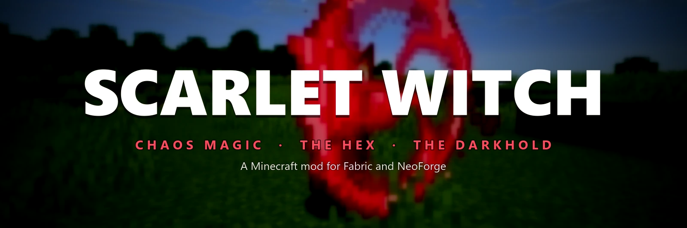

[](#compatibility)
[](#installation)
[](#installation)
[](#compatibility)

### Put on the tiara, weave on the costume, master her spells one by one,<br>and bend a whole town into a sitcom inside the Hex.

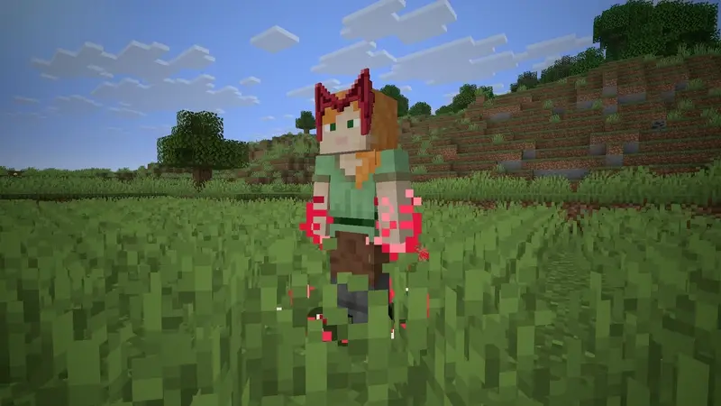

<!-- The full launch trailer goes on the line below: edit this file on github.com and drag "Scarlet Witch - Launch Trailer (GitHub upload).mp4" onto it, and GitHub turns it into a player. -->

[The crown](#the-crown-is-the-power) · [Chaos magic](#chaos-magic) · [The Hex](#the-hex) · [The Darkhold](#the-darkhold) · [Recipes](#recipes) · [Controls](#controls) · [Install](#installation)

</div>

<br>

Chaos magic inspired by the Scarlet Witch, for Minecraft 26.3 on Fabric and NeoForge. Every clip on this page is recorded in game.

## The crown is the power

<table>
<tr>
<td width="50%" valign="top">
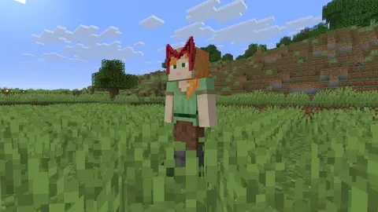
</td>
<td width="50%" valign="top">
<p> </p>
<p><b>Two crowns, the same powers:</b> the Scarlet Witch's tiara and the Scarlet Warlock's crown. Whoever wears one has the magic; take it off and the magic goes with it.</p>
<p><b>Suit up with <kbd>G</kbd>:</b> scarlet threads spiral up from your feet and the costume weaves on, the cape unfurling and the crown flaring last. Press it again and it burns away into embers.</p>
</td>
</tr>
</table>

- Worn in the helmet slot, a crown protects like a diamond helmet and never breaks. A crown alone in the crafting grid turns into the other one, keeping everything on it.
- **Mastery** grows as you cast and is stored on the crown, so a stolen crown carries everything its owner learned.

## Chaos magic

Hold <kbd>R</kbd> to open the spell wheel, aim at a spell and let go. Cast with **right click and an empty main hand**. Each spell opens up at its rank of mastery.

<table>
<tr>
<td width="50%" valign="top">
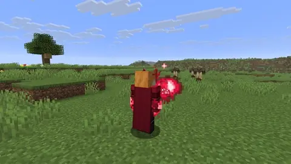
<p>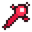 <b>Chaos Bolt</b> &nbsp;<sub>RANK 1</sub><br>Fire blasts of scarlet energy.</p>
</td>
<td width="50%" valign="top">
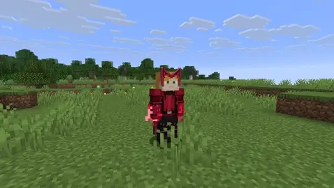
<p> <b>Chaos Shield</b> &nbsp;<sub>RANK 1</sub><br>Hold to raise a disc of energy that stops blows and turns projectiles back.</p>
</td>
</tr>
<tr>
<td width="50%" valign="top">
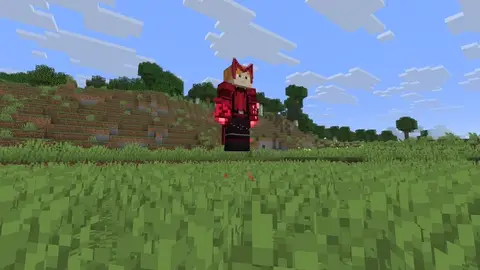
<p>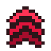 <b>Levitation</b> &nbsp;<sub>RANK 2</sub><br>Double-tap jump to rise and fly, and keep casting in the air.</p>
</td>
<td width="50%" valign="top">
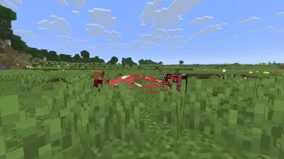
<p> <b>Telekinesis</b> &nbsp;<sub>RANK 3</sub><br>Grab, lift and throw creatures, players and blocks.</p>
</td>
</tr>
<tr>
<td width="50%" valign="top">
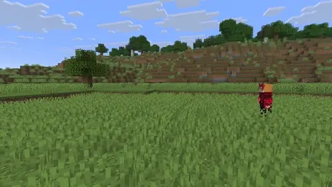
<p> <b>Red Mist</b> &nbsp;<sub>RANK 4</sub><br>Dissolve and reappear up to 12 blocks away.</p>
</td>
<td width="50%" valign="top">
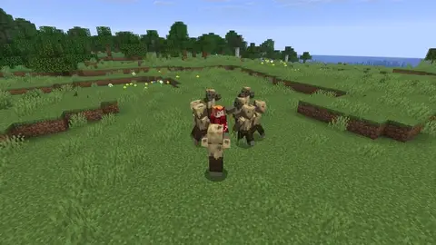
<p> <b>Shockwave</b> &nbsp;<sub>RANK 5</sub><br>A burst that throws everything back.</p>
</td>
</tr>
<tr>
<td width="50%" valign="top">
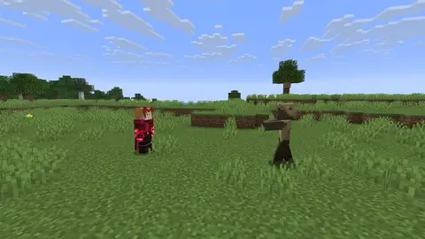
<p> <b>Mind Control</b> &nbsp;<sub>RANK 6</sub><br>Look out through a creature's eyes and steer it. Players only for a few seconds, and they can struggle free.</p>
</td>
<td width="50%" valign="top">
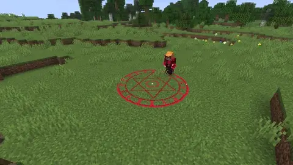
<p> <b>Rune Trap</b> &nbsp;<sub>RANK 7</sub><br>Write a sigil on the ground that binds whatever steps onto it.</p>
</td>
</tr>
</table>

Every power is drawn as hard-edged pixel art in stepped shades of scarlet, matched to Minecraft's own texels.

## The Hex

 <sub>RANK 10</sub> &nbsp;A hexagonal wall of static spreads out from you and stays where you cast it. Anyone can walk in; you can kick them out. **Inside, the world is a sitcom.**

<table>
<tr>
<td width="50%" valign="top">
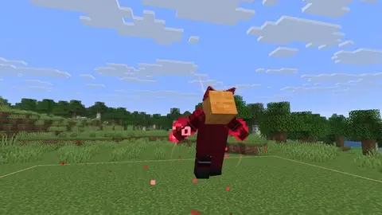
<p><b>Raise a Hex</b><br>Cast it and your sitcom home builds itself around you: frame, walls, roof and furniture.</p>
</td>
<td width="50%" valign="top">
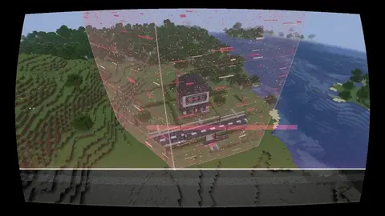
<p><b>It builds Westview</b><br>Your home, or a whole suburb with streets, lawns and picket fences, made over from whatever already stands rather than torn down.</p>
</td>
</tr>
<tr>
<td width="50%" valign="top">
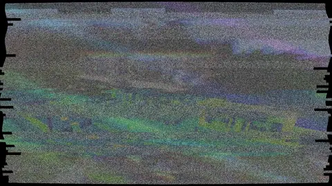
<p><b>Six sitcom eras</b><br>From 1950s black and white through 70s film color and 80s videotape to the present day, with era clothes for everyone inside, sound like an old television's speaker and a laugh track.</p>
</td>
<td width="50%" valign="top">
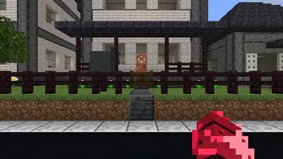
<p><b>Title cards</b><br>Every era opens on its own title card and note-block theme.</p>
</td>
</tr>
<tr>
<td width="50%" valign="top">
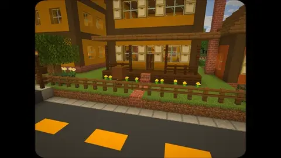
<p><b>Townspeople</b><br>Hostile mobs become townspeople who sit on couches, switch on the television, chat with their hands and wave as you pass.</p>
</td>
<td width="50%" valign="top">
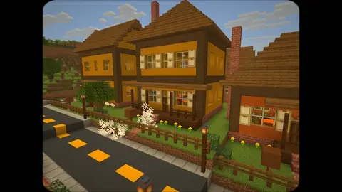
<p><b>Blasts mend themselves</b><br>Whatever a creeper or TNT breaks inside comes back, chests and all.</p>
</td>
</tr>
<tr>
<td width="50%" valign="top">
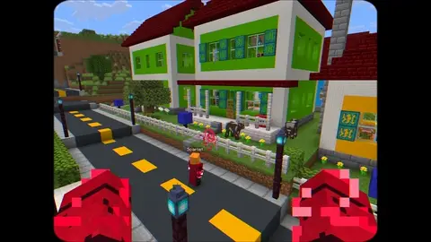
<p><b>Rewind the scene</b><br>Hold rewind and the last ten seconds run backward, shown the way that era's set would: film juddering through a 1950s projector, a VHS tape whining back with "REW" in the corner, a smooth scrub today.</p>
</td>
<td width="50%" valign="top">
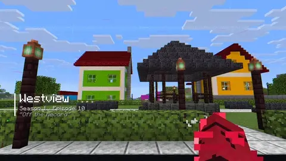
<p><b>The Showrunner remote</b><br>Press <kbd>H</kbd> to change the era, the time of day and the weather, start a new episode every morning, name your Hex, move your home and hold its rewind button.</p>
</td>
</tr>
<tr>
<td colspan="2" align="center" valign="top">
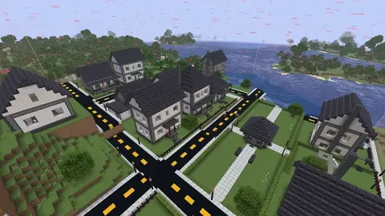
<p><b>The Hex falls</b><br>When it comes down, everything goes back the way it was.</p>
</td>
</tr>
</table>

- Creatures and players walk back the way they came, wounds close, broken blocks return and the fallen get back up. Nothing can be duplicated with the rewind: what someone has already picked up stays picked up.
- The remote also chooses what the next Hex builds.
- **Era furniture:** a television, radio, telephone, fridge, stove, toaster, couch, armchair, lamp, wall clock, picture frames, posters and a parked car, each changing with the era. All craftable.

## The Darkhold

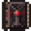 A late-game grimoire of carved stone and bronze. Read it and it rises out of your hand and floats open before you, turning its own pages.

<table>
<tr>
<td width="50%" valign="top">
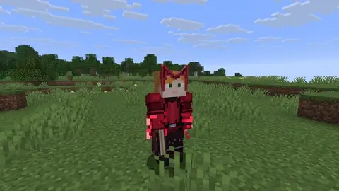
<p><b>It corrupts whoever reads it</b><br>Your magic darkens toward black-crimson for everyone who sees it, dark veins creep in at the edges of your sight, and it whispers.</p>
</td>
<td width="50%" valign="top">
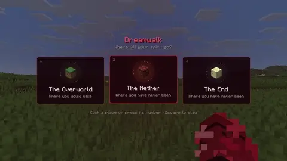
<p>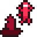 <b>Dreamwalking</b><br>Your body sits down cross-legged and rises into the air while your spirit goes into a creature in any dimension, even the Nether or the End. A blow to your body snaps you back to defend it.</p>
</td>
</tr>
</table>

Past halfway it brings hunger, sleepless nights and worse. It fades once you stop.

## Recipes

<table>
<tr>
<td align="center" width="33%">
<br><b>Scarlet Witch's tiara</b>
<pre>G A G
R G R</pre>
</td>
<td align="center" width="33%">
<br><b>Scarlet Warlock's crown</b>
<pre>R A R
G G G</pre>
</td>
<td align="center" width="33%">
<br><b>The Darkhold</b>
<pre>E C E
C B C
E C E</pre>
</td>
</tr>
</table>

<sub><b>G</b> gold ingot · <b>R</b> redstone dust · <b>A</b> amethyst shard · <b>E</b> echo shard · <b>C</b> crying obsidian · <b>B</b> book</sub>

## Controls

| Key | Action |
|---|---|
| <kbd>G</kbd> | Suit up and down |
| <kbd>R</kbd> (hold) | Spell wheel |
| Right click, empty hand | Cast the chosen spell |
| Double-tap jump | Levitate (or bind a key of its own) |
| <kbd>H</kbd> | Showrunner remote |
| Rewind (bind a key) | Hold to rewind the last ten seconds inside your Hex |

## Settings and accessibility

Effects quality, reduce flashing, reduce camera shake, reduce screen effects, instant transformations, the cinematic camera when a Hex is founded, and era audio. Open the settings from the tiara in the corner of the Options screen, from the mod list on NeoForge, or with a key of your own.

## Multiplayer

The server decides what happens and every client sees it, so everything works on dedicated servers. Server owners can turn off Mind Control on players (or shorten it), the Darkhold's side effects, dreamwalking, and the rewind (or just leave other players out of it) in `config/scarlet-server.json`.

## Compatibility

- Minecraft 26.3, on Fabric (with Fabric API) or NeoForge. Java 25.
- Works with Sodium.
- Works with Iris shader packs on Fabric (tested with Complementary Reimagined). On NeoForge, Iris 1.11.7 currently crashes as a world loads with a shader pack on; the crash is inside Iris.
- Runs on both the OpenGL and Vulkan graphics backends.

## Installation

1. Install Minecraft 26.3 with [Fabric](https://fabricmc.net/use/installer/) and [Fabric API](https://modrinth.com/mod/fabric-api), or with [NeoForge](https://neoforged.net/).
2. Download the Scarlet Witch jar for your loader from the [releases](../../releases).
3. Drop it into your `mods` folder and start the game.

<details>
<summary><b>Building from source</b></summary>

<br>

With JDK 25 installed:

```
./gradlew build
```

The jars land in `fabric/build/libs` and `neoforge/build/libs`. `./gradlew :fabric:runClient` and `./gradlew :neoforge:runClient` open a development copy of the game.

</details>

## Credits

Made by Yashjit. Every texture is drawn by the mod's own generator (`tools/assetgen`) and every sound is one of Minecraft's own: nothing is taken from the films. The costumes take after Arrzee's Multiverse skins, used as reference only. See [CREDITS.md](CREDITS.md).

This is an unofficial fan work, not affiliated with or endorsed by Marvel or Disney. NOT AN OFFICIAL MINECRAFT PRODUCT. NOT APPROVED BY OR ASSOCIATED WITH MOJANG OR MICROSOFT.

© 2026 Yashjit. All rights reserved for now; see [LICENSE](LICENSE).
